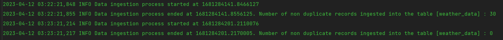
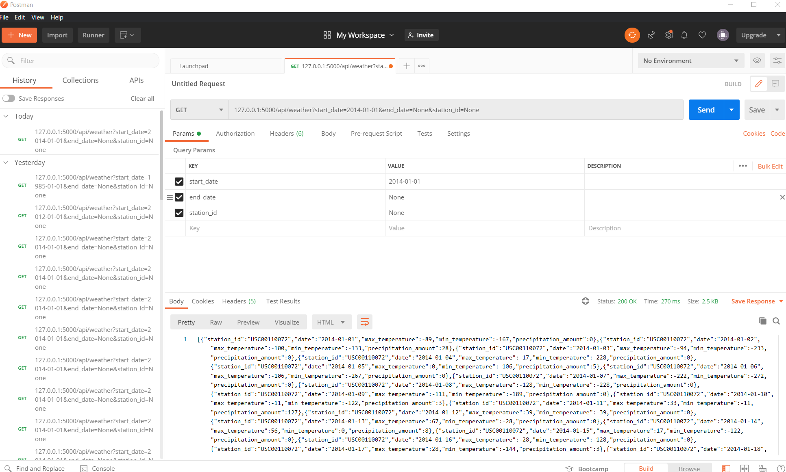

## Python Environment Setup
Create a conda environment -> conda create -n cropetl python=3.8 and  
then install the requirements.txt file using pip install -r requirements.txt command.  

# Project Components:
## src folder containing python modules of the application
1. #### Data Modelling: Database creation with respective tables to store data using src/db_conn.py
    ###### Table to store weather data from wx_data folder
    
    ###### Table to store yield data from yld_data folder
    
    ###### For every year, for every weather station, calculate: Table to store calculated stats data
        * Average maximum temperature (in degrees Celsius)
        * Average minimum temperature (in degrees Celsius)
        * Total accumulated precipitation (in centimeters)
    

2. #### Ingestion : Write code to ingest the weather data from the raw text files supplied into your database, using the model you designed. Check for duplicates: if your code is run twice, you should not end up with multiple rows with the same data in your database. Your code should also produce log output indicating start and end times and number of records ingested.
    ###### Python code used:
        * src/data_operations.py InsertData module
        * Checking for duplicate records first and then proceed with ingestion
    
3. #### Data Analysis : to do statistical analysis and store that in weather_data_stats table in PostgreSQL
    ###### Python code used:
        # src/analyze.py Analysis Module
            * analyzeData() - This method analyzes weather data for every year and every weather station and calculates the average maximum and minimum temperature (in degrees Celsius) and 
              total accumulated precipitation (in centimeters) ignoring missing data. The method returns a pandas DataFrame after analysis.
            * insertStatsData() - This method creates a table called weather_data_stats if it does not already exist and analyzes weather data to create statistics.
              It then inserts non-duplicate rows into the weather_data_stats table. The method logs the start and end times of the data ingestion process and the number of non-duplicate records inserted into the table.

4. #### REST API : Choose a web framework (e.g. Flask, Django REST Framework). Create a REST API with the following GET endpoints:

        * /api/weather
        * /api/weather/stats
    
   * Code used :
     * src/data_operations.py Fetch Data Module
     * /api/weather : service.py get_weather_data()
     
     * /api/weather/stats: service.py get_weather_data_stats()
     
     
   ##### * Fetch Data Module
         * The __init__ method initializes the class with the given parameters, including start_date, end_date, station_id, page_size, and page_number. 
           These parameters are used to generate SQL queries for fetching data from a weather_data table.
         * The fetchData method fetches weather data from the database based on the user input and returns it as a Pandas dataframe. 
            It uses the SQL query generated by the __init__ method and adds a LIMIT and OFFSET clause to support pagination.
         * The fetchDataStats method is similar to the fetchData method, but it removes records with missing values which is -9999  and create required statistics before returning 
            the result as a Pandas dataframe. I dont want pagination for my stats result so I removed it.
            Creating a visualization from the whole statistics would be easy without the pagination
   
5. #### Swagger API: Include a Swagger/OpenAPI endpoint that provides automatic documentation of your API.
    
    
    

6. #### Deployment: Assume you are asked to get your code running in the cloud using AWS. What tools and AWS services would you use to deploy the API, database, and a scheduled version of your data ingestion code? Write up a description of your approach.
   
   * Amazon EC2 : I would use Docker to containerize my Flask application and Amazon ECS to deploy and manage the containers.
   * Scheduling the data ingestion code: To schedule the Lambda function to run on a regular basis, I would use AWS CloudWatch Events. I would create a scheduled event rule to trigger my Lambda function at the desired interval.
      
    
    